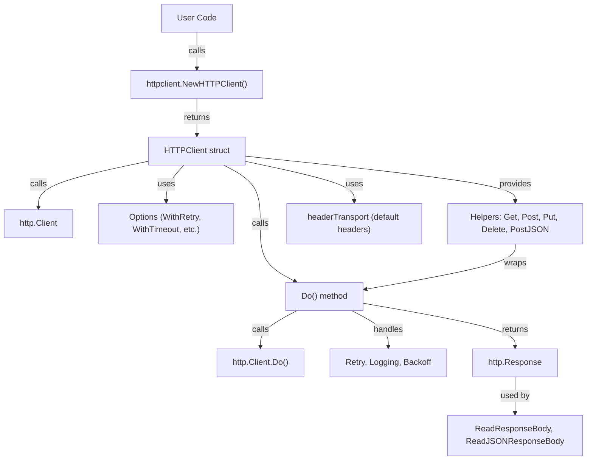

# httpclient

A modern, lightweight, and extensible HTTP client library for Go, designed to make HTTP requests simple, reliable, and powerful. `httpclient` wraps Go's standard `http.Client` and adds advanced features such as retries, exponential backoff, custom logging, default headers, and more, all with an easy-to-use API.

---

## Features

- **Simple API**: Clean, intuitive methods for GET, POST, PUT, DELETE, and JSON requests.
- **Retries & Exponential Backoff**: Automatically retry failed requests with optional exponential backoff.
- **Custom Logging**: Plug in your own logger for detailed request/response logs.
- **Default Headers**: Set headers to be included in every request.
- **Custom Transport & TLS**: Use your own `http.RoundTripper` or TLS configuration.
- **Timeouts**: Easily configure request timeouts.
- **Response Helpers**: Utility functions to read and unmarshal response bodies.
- **Well-tested**: Comprehensive unit tests for reliability.

---

## Architecture

The core of `httpclient` is the `HTTPClient` struct, which wraps Go's `http.Client` and is configured using functional options. Helper methods provide a simple interface for common HTTP operations, while advanced features like retries and logging are built-in.



---

## Installation

```bash
go get github.com/chinnareddy578/httpclient
```

## Importing

```go
import "github.com/chinnareddy578/httpclient"
```

---

## Usage

### Creating a Client

```go
client := httpclient.NewHTTPClient(
    httpclient.WithTimeout(5 * time.Second),
    httpclient.WithRetry(3, 1 * time.Second),
    httpclient.WithLogger(log.Default()),
    httpclient.WithDefaultHeaders(map[string]string{"X-App": "myapp"}),
)
```

### GET Request

```go
headers := map[string]string{"Authorization": "Bearer token"}
resp, err := client.Get("https://api.example.com/data", headers)
if err != nil {
    log.Fatal(err)
}
body, _ := httpclient.ReadResponseBody(resp)
fmt.Println(body)
```

### POST Request (Raw Body)

```go
body := bytes.NewBufferString("raw payload")
headers := map[string]string{"Content-Type": "text/plain"}
resp, err := client.Post("https://api.example.com/upload", body, headers)
if err != nil {
    log.Fatal(err)
}
bodyStr, _ := httpclient.ReadResponseBody(resp)
fmt.Println(bodyStr)
```

### POST Request (JSON)

```go
payload := map[string]interface{}{"name": "John", "age": 30}
headers := map[string]string{"Authorization": "Bearer token"}
resp, err := client.PostJSON("https://api.example.com/users", payload, headers)
if err != nil {
    log.Fatal(err)
}
var result map[string]interface{}
_ = httpclient.ReadJSONResponseBody(resp, &result)
fmt.Println(result)
```

### PUT Request

```go
update := map[string]interface{}{"age": 31}
updateBody, _ := json.Marshal(update)
headers := map[string]string{"Content-Type": "application/json"}
resp, err := client.Put("https://api.example.com/users/1", bytes.NewReader(updateBody), headers)
if err != nil {
    log.Fatal(err)
}
bodyStr, _ := httpclient.ReadResponseBody(resp)
fmt.Println(bodyStr)
```

### DELETE Request

```go
headers := map[string]string{"Authorization": "Bearer token"}
resp, err := client.Delete("https://api.example.com/users/1", headers)
if err != nil {
    log.Fatal(err)
}
bodyStr, _ := httpclient.ReadResponseBody(resp)
fmt.Println(bodyStr)
```

---

## Advanced Features & Options

- **WithRetry(retryCount, retryDelay)**: Set the number of retries and delay between retries for failed requests.
- **WithExponentialBackoff(baseDelay)**: Enable exponential backoff for retries.
- **WithLogger(logger)**: Use a custom logger for request/response logging.
- **WithTransport(transport)**: Use a custom `http.RoundTripper` for advanced networking.
- **WithTLSConfig(tlsConfig)**: Set a custom TLS configuration.
- **WithDefaultHeaders(headers)**: Set default headers for all requests.
- **WithTimeout(timeout)**: Set a timeout for all requests.

---

## Submitting Suggestions and Issues

We welcome suggestions, bug reports, and feature requests! Please use the [GitHub Issues page](https://github.com/chinnareddy578/httpclient/issues) to submit your feedback.

---

## Contribution Guide

1. Fork the repository on GitHub.
2. Create a new branch for your feature or bug fix:
   ```bash
   git checkout -b feature-name
   ```
3. Make your changes and commit them with clear and concise messages.
4. Push your changes to your forked repository:
   ```bash
   git push origin feature-name
   ```
5. Open a pull request on the main repository.

### Guidelines
- Ensure your code follows Go best practices.
- Write tests for any new features or bug fixes.
- Update the documentation if necessary.

---

## References

- [GitHub Repository](https://github.com/chinnareddy578/httpclient)
- [GoDoc Documentation](https://pkg.go.dev/github.com/chinnareddy578/httpclient)

---

## License

This project is licensed under the MIT License. See the `LICENSE` file for details.

