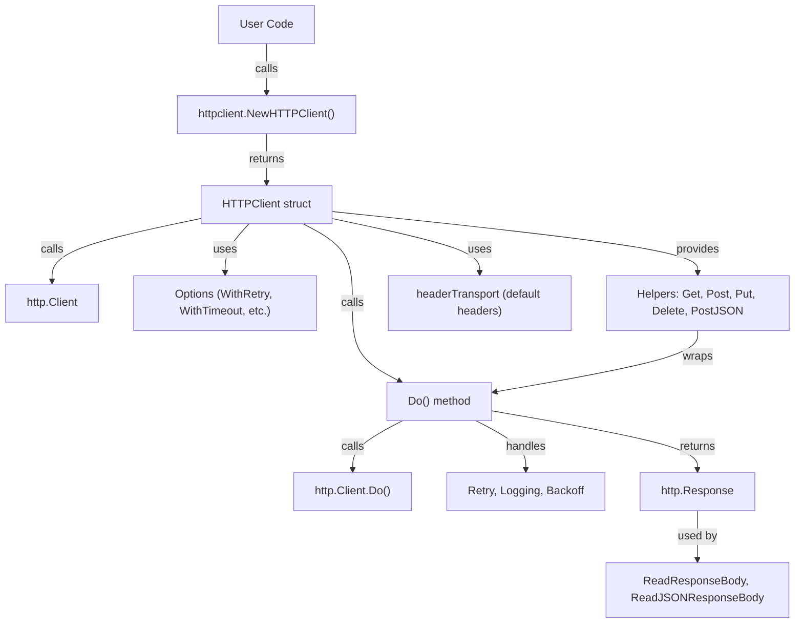

# httpclient: A Modern, Lightweight HTTP Client for Go

## Introduction

`httpclient` is a lightweight and efficient HTTP client library written in Go. It simplifies making HTTP requests by providing an easy-to-use interface for GET, POST, PUT, DELETE, and other HTTP methods. This library is designed to handle common use cases like setting headers, query parameters, and handling JSON payloads, while also supporting advanced features like retries, exponential backoff, custom logging, and more.

---

## Architecture

The architecture of `httpclient` is modular and extensible, built around a core `HTTPClient` struct that wraps Go's standard `http.Client` and adds additional features via functional options. Here is a high-level architecture diagram:



---

## Detailed Explanation

### Core Components

- **HTTPClient struct**: The main client, wrapping Go's `http.Client` and adding retry, logging, backoff, and default headers.
- **Options**: Functional options like `WithRetry`, `WithTimeout`, `WithLogger`, `WithTransport`, `WithTLSConfig`, and `WithDefaultHeaders` allow you to customize the client.
- **Helpers**: Methods like `Get`, `Post`, `Put`, `Delete`, and `PostJSON` provide a simple interface for common HTTP operations.
- **Retry & Backoff**: Built-in support for retrying failed requests, with optional exponential backoff.
- **Custom Logging**: Plug in your own logger for request/response logging.
- **Default Headers**: Set headers to be included in every request.
- **Response Helpers**: Utility functions to read and unmarshal response bodies.

### Why Use httpclient?
- **Simplicity**: Clean, easy-to-use API for common HTTP tasks.
- **Extensibility**: Add custom behavior via options.
- **Reliability**: Automatic retries and backoff for transient errors.
- **Testability**: Well-tested with unit tests and easy to mock.

---

## Installation

```bash
go get github.com/chinnareddy578/httpclient
```

## Importing

```go
import "github.com/chinnareddy578/httpclient"
```

---

## Usage

### Creating a Client

```go
client := httpclient.NewHTTPClient(
    httpclient.WithTimeout(5 * time.Second),
    httpclient.WithRetry(3, 1 * time.Second),
    httpclient.WithLogger(log.Default()),
    httpclient.WithDefaultHeaders(map[string]string{"X-App": "myapp"}),
)
```

### GET Request

```go
headers := map[string]string{"Authorization": "Bearer token"}
resp, err := client.Get("https://api.example.com/data", headers)
if err != nil {
    log.Fatal(err)
}
body, _ := httpclient.ReadResponseBody(resp)
fmt.Println(body)
```

### POST Request (Raw Body)

```go
body := bytes.NewBufferString("raw payload")
headers := map[string]string{"Content-Type": "text/plain"}
resp, err := client.Post("https://api.example.com/upload", body, headers)
if err != nil {
    log.Fatal(err)
}
bodyStr, _ := httpclient.ReadResponseBody(resp)
fmt.Println(bodyStr)
```

### POST Request (JSON)

```go
payload := map[string]interface{}{"name": "John", "age": 30}
headers := map[string]string{"Authorization": "Bearer token"}
resp, err := client.PostJSON("https://api.example.com/users", payload, headers)
if err != nil {
    log.Fatal(err)
}
var result map[string]interface{}
_ = httpclient.ReadJSONResponseBody(resp, &result)
fmt.Println(result)
```

### PUT Request

```go
update := map[string]interface{}{"age": 31}
updateBody, _ := json.Marshal(update)
headers := map[string]string{"Content-Type": "application/json"}
resp, err := client.Put("https://api.example.com/users/1", bytes.NewReader(updateBody), headers)
if err != nil {
    log.Fatal(err)
}
bodyStr, _ := httpclient.ReadResponseBody(resp)
fmt.Println(bodyStr)
```

### DELETE Request

```go
headers := map[string]string{"Authorization": "Bearer token"}
resp, err := client.Delete("https://api.example.com/users/1", headers)
if err != nil {
    log.Fatal(err)
}
bodyStr, _ := httpclient.ReadResponseBody(resp)
fmt.Println(bodyStr)
```

---

## Advanced Features

- **Retries & Exponential Backoff**: Use `WithRetry` and `WithExponentialBackoff` to handle transient errors gracefully.
- **Custom Logger**: Pass your own logger for detailed request/response logs.
- **Custom Transport & TLS**: Use `WithTransport` and `WithTLSConfig` for advanced networking needs.
- **Default Headers**: Set headers to be included in every request.

---

## Submitting Suggestions and Issues

We welcome suggestions and issues! Please use the [GitHub Issues page](https://github.com/chinnareddy578/httpclient/issues) to submit bugs, feature requests, or general feedback.

---

## Contributing

1. Fork the repository on GitHub.
2. Create a new branch for your feature or bug fix:
   ```bash
   git checkout -b feature-name
   ```
3. Make your changes and commit them with clear and concise messages.
4. Push your changes to your forked repository:
   ```bash
   git push origin feature-name
   ```
5. Open a pull request on the main repository.

### Guidelines
- Ensure your code follows Go best practices.
- Write tests for any new features or bug fixes.
- Update the documentation if necessary.

---

## References

- [GitHub Repository](https://github.com/chinnareddy578/httpclient)
- [GoDoc Documentation](https://pkg.go.dev/github.com/chinnareddy578/httpclient)

---

## License

This project is licensed under the MIT License. See the `LICENSE` file for details. 